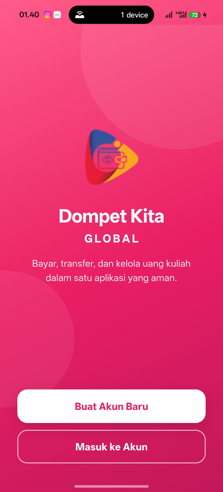
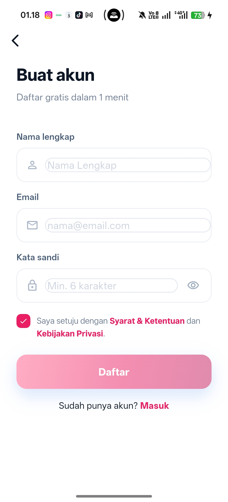
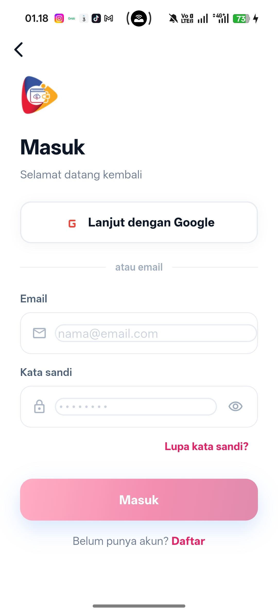
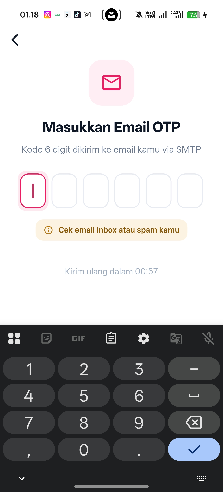
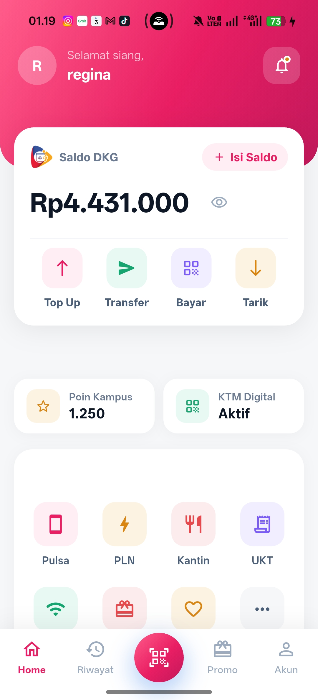
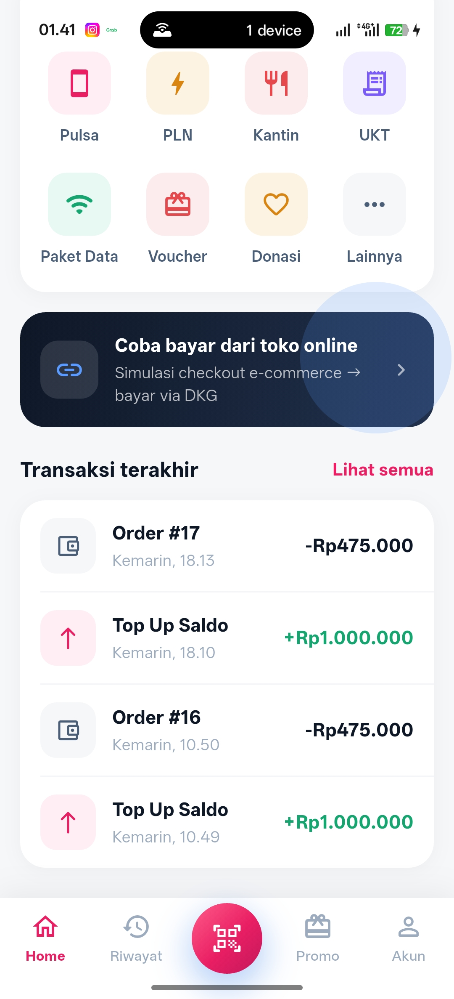
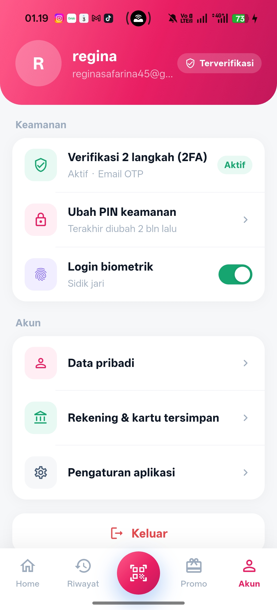

# 💳 Dompet Kita (E-Money)

Aplikasi **Dompet Kita** merupakan aplikasi **E-Money** berbasis Flutter yang dikembangkan sebagai proyek **Ujian Akhir Semester (UAS) Aplikasi Mobile Lanjutan**.

Aplikasi ini terintegrasi dengan aplikasi **E-Commerce** menggunakan mekanisme **Deep Link (App-to-App Integration)** sehingga pengguna dapat melakukan pembayaran digital secara langsung melalui aplikasi Dompet Kita.

---

# 📱 Fitur Utama

- 🔐 Login menggunakan Firebase Authentication
- 👤 Registrasi akun pengguna
- 💰 Melihat saldo E-Money
- 📊 Riwayat transaksi
- 💳 Pembayaran melalui Deep Link
- 🔑 Verifikasi transaksi menggunakan Two Factor Authentication (2FA)
- 🔔 Notifikasi transaksi menggunakan Firebase Cloud Messaging (FCM)
- 📥 Callback hasil pembayaran ke aplikasi Merchant
- 🌙 UI Modern dan Responsive

---

### Teknologi yang digunakan

- Flutter
- Dart
- Firebase Authentication
- Firebase Cloud Messaging
- Dio
- Provider
- Deep Link (app_links)
- REST API
- Shared Preferences

---

# 🔄 Arsitektur Sistem

```
User
   │
   ▼
Flutter E-Money
   │
   ├──────────────► Firebase Authentication
   │
   ├──────────────► Backend API
   │                    │
   │                    ▼
   │                 Database
   │
   └──────────────► Deep Link
                         │
                         ▼
               Aplikasi Merchant
```

---

# 🔗 Implementasi Deep Link

Aplikasi menggunakan **Custom Scheme Deep Link** sebagai media komunikasi antar aplikasi.

Flow pembayaran:

```
Merchant
    │
    ▼
Deep Link
(dompetkita://pay)
    │
    ▼
Dompet Kita
    │
    ▼
Verifikasi PIN + 2FA
    │
    ▼
Potong Saldo
    │
    ▼
Callback
merchant://payment-callback
```

---

# 🔒 Two Factor Authentication (2FA)

Untuk menjaga keamanan transaksi, setiap pembayaran akan melalui proses:

1. User memilih pembayaran E-Money.
2. Merchant mengirim Deep Link.
3. Dompet Kita menerima request pembayaran.
4. User melakukan verifikasi PIN / OTP (2FA).
5. Backend memvalidasi transaksi.
6. Saldo dipotong.
7. Callback dikirim ke aplikasi Merchant.

---
 
#🖥️ Backend

Repository Backend:

https://github.com/ginaa07/be-money

Backend menangani:

- Authentication
- Wallet
- Saldo
- Payment
- Transaction
- Deep Link Callback
- Firebase Token
- Two Factor Authentication

---

# 🚀 Cara Menjalankan Project

## 1 Clone Repository

```bash
git clone https://github.com/ginaa07/be-money.git
```

## 2 Masuk Folder

```bash
cd be-money
```

## 3 Install Dependency

```bash
flutter pub get
```

## 4 Jalankan Project

```bash
flutter run
```

---

# 📦 Dependency Utama

```yaml
firebase_core
firebase_auth
firebase_messaging
dio
provider
shared_preferences
app_links
url_launcher
flutter_local_notifications
intl
```

---

## Tampilan UI Dompet Kita
- **Nama** : Dompetkita

## 📸 Screenshots
<p align="center">
  







    ---

    # 📂 Struktur Project

```
lib
│
├── core
├── data
├── domain
├── injection
├── presentation
├── firebase_options.dart
└── main.dart
```
---
# 🛠️ Tools

- Flutter SDK
- Dart
- Android Studio
- Visual Studio Code
- Firebase
- Postman
- Git
- GitHub

---

# 📚 Mata Kuliah

Aplikasi Mobile Lanjutan

Institut Teknologi dan Bisnis Bina Sarana Global

Semester Genap 2026

---
